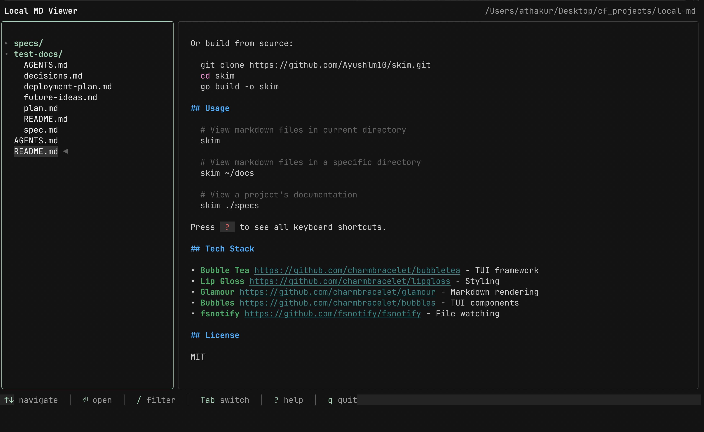

# skim

A terminal-based markdown viewer built with the [Charm](https://charm.sh) Go TUI stack.


## Features

- **Dual-panel layout** - File tree (25%) and markdown preview (75%)
- **Beautiful rendering** - Glamour-powered markdown with automatic light/dark terminal adaptation
- **File tree navigation** - Expand/collapse directories, filter files with fuzzy search
- **In-preview search** - Search within content with match highlighting and navigation
- **Live reload** - Automatic re-render when files change on disk
- **Keyboard-driven** - Vim-style navigation with full mouse support
- **Minimal aesthetic** - Clean, editorial design with muted colors

## Screenshot



## Installation

```bash
go install github.com/Ayushlm10/skim@latest
```

Or build from source:

```bash
git clone https://github.com/Ayushlm10/skim.git
cd skim
go build -o skim
```

## Usage

```bash
# View markdown files in current directory
skim

# View markdown files in a specific directory
skim ~/docs

# View a project's documentation
skim ./specs
```

Press `?` to see all keyboard shortcuts.

## Tech Stack

- [Bubble Tea](https://github.com/charmbracelet/bubbletea) - TUI framework
- [Lip Gloss](https://github.com/charmbracelet/lipgloss) - Styling
- [Glamour](https://github.com/charmbracelet/glamour) - Markdown rendering
- [Bubbles](https://github.com/charmbracelet/bubbles) - TUI components
- [fsnotify](https://github.com/fsnotify/fsnotify) - File watching

## License

MIT
